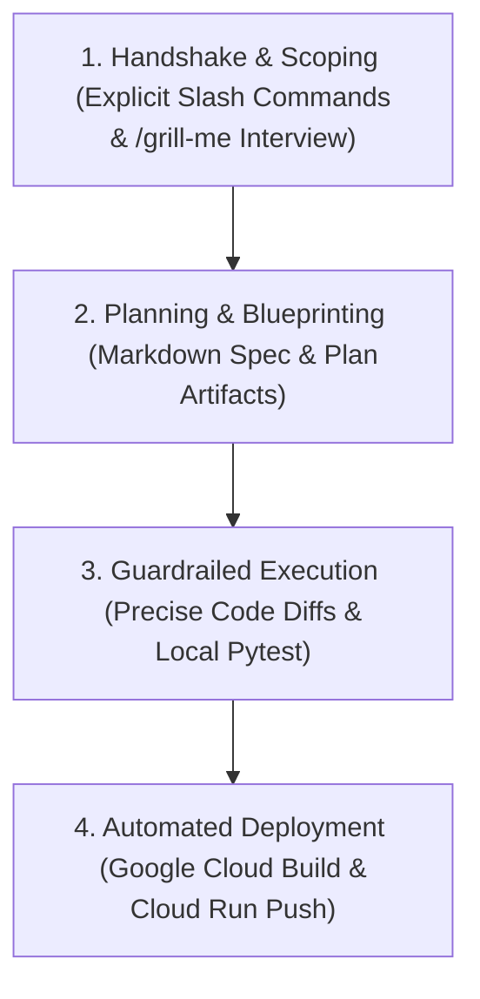

# Live Demonstration Playbook: Agentic SDLC & Platform Evolution

This playbook is the canonical guide for live demonstrations of the **Tesla Solar Sync** application using **Antigravity-CLI**. It is structured specifically for presenters (even those unfamiliar with the app) to showcase **Lite-SDLC agentic-development workflows**—highlighting the human-agent collaborative handshake using explicit slash command triggers.

---

## 🛠️ The Lite-SDLC Agentic Workflow Blueprint

When presenting this application, the core "wow" factor is showing how **Antigravity-CLI** acts as an elite co-developer. For each scenario, guide the audience through this **4-Step SDLC Loop**:



---

## 📋 Scenario Walkthrough Matrix

| ID | Category | Scenario Name | Primary Files Involved | Target Impact | Git Demo Branch |
| :--- | :--- | :--- | :--- | :--- | :--- |
| **SC-1** | **Fix** | Kinetic Power Flow & CRT Viewport Fix | `src/frontend/modules/svg_flow.js`<br>`src/frontend/index.css` | Align SVG conduits on-axis, round telemetry floats, and constrain CRT container overflow. | `scenario/sc-1-fix` |
| **SC-2** | **Feature** | Integrated "Lux Sync" Cohesion Dial | `src/frontend/modules/svg_flow.js` | Create an integrated central dial measuring real-time solar self-sufficiency. | `scenario/sc-2-feature` |
| **SC-3** | **Optimization** | Dynamic EMA Alpha Control Loop Tuning | `src/frontend/index.html`<br>`src/frontend/index.css`<br>`src/frontend/modules/config.js`<br>`src/frontend/app.js` | Add a tactile configuration slider and Nixie readout to adjust loop dampening on-the-fly. | `scenario/sc-3-optimization` |

---

## SC-1: Kinetic Power Flow & CRT Viewport Fix (The "Fix" Scenario)

### 1. The Human-Agent Handshake (Scoping)
* **The Explicit Starting Prompt:**
  > `/goal Analyze our steampunk dashboard UI and resolve three visual issues: 1) Mathematically align the off-axis energy conduit SVG pipelines leading to the center gear, 2) Wrap all raw decimal telemetry metrics in integer rounding to prevent label overlap, and 3) Constrain the CRT monitor's height in CSS so its scanning shadows do not bleed over the footer log ticker.`
* **The Agentic Workflow:**
  By prefixing the request with the explicit **`/goal`** trigger, the presenter tells the CLI to launch a comprehensive, thorough agent task that won't stop until all three criteria are verified. The agent scans the active UI code, identifies the exact coordinates, and structures a solution.

### 2. Design & Planning (The Blueprint)
* **The Agentic Plan:**
  Before touching any code, the agent generates a markdown plan outlining the precise coordinate alignments:
  * **Conduit realignment:** Adjust the geometric anchor points of the SVG coordinates to match clean $\pm 0.5$ slope lines, ensuring perfectly straight, symmetry-aligned pipelines.
  * **Telemetry Decimal Overflow:** Wrap all raw WebSocket telemetry outputs in `Math.round()` to prevent long floats (e.g., `595.7459...W`) from overlapping labels.
  * **CRT screen constraint:** Redefine height limits to fit perfectly inside the designated panel layout.

### 3. Guardrailed Execution (Code & Verification)
* **The Code Diff:**
  The agent executes the modifications using highly targeted edits:
  ```diff
               <!-- Inverter to House Load -->
  -            <path id="pipe-house" d="M 340,210 L 480,130" stroke="url(#metal-iron)" ... />
  +            <path id="pipe-house" d="M 340,180 L 480,110" stroke="url(#metal-iron)" ... />
  ```
* **Self-Healing / Local Verification:**
  The agent runs local validation to ensure no responsive CSS breakouts occur across viewport boundaries.

### 4. Live Demonstration Steps (The Pitch)
1. **Checkout Branch:** `git checkout scenario/sc-1-fix`
2. **Point out the alignment:** Show the audience the beautifully straight copper conduits representing energy pathways leading into the central cog.
3. **Point out the telemetry:** Note that all metrics are clean, rounded integers.
4. **Point out the CRT Bezel:** Show that the CRT scanlines and bezel sit perfectly inside the container without overlapping the bottom main engine log ticker.

---

## SC-2: Integrated "Lux Sync" Cohesion Dial (The "Feature" Scenario)

### 1. The Human-Agent Handshake (Scoping & `/grill-me`)
* **The Explicit Starting Prompt:**
  > `/grill-me I want to show solar charging efficiency in a premium way. Maybe some kind of central sync gauge?`
* **The Agentic Workflow:**
  By prefixing the prompt with the explicit **`/grill-me`** trigger, the presenter forces the Antigravity-CLI to immediately bypass raw code writing and enter the interactive scoping interview loop. The agent boots its requirement-scoping persona and asks 2–3 precise architectural questions to lock down specifications:
  1. *What should the formula be?* (Determines: Cohesion % is Solar divided by Total House + EV load).
  2. *Where should it live?* (Determines: Overlaying the central rotating gears of the flow SVG).
  3. *What should the color states represent?* (Determines: Red for heavy grid imports, Teal/Green for 100% solar self-sufficiency).

### 2. Design & Planning (The Blueprint)
* **The Agentic Plan:**
  The agent creates a design spec detailing the SVG overlays and math model:
  $$\text{Cohesion (\%)} = \min\left(\frac{\text{Solar Generation}}{\text{House Load} + \text{EV Charging Power}}, 1.0\right) \times 100$$
  * Needle sweeps clockwise to $+110^\circ$ (Teal) for 100% cohesion.
  * Needle sweeps counter-clockwise to $-110^\circ$ (Crimson) for low cohesion.

### 3. Guardrailed Execution (Code & Verification)
* **The Code Diff:**
  The agent safely integrates the SVG dial into the central cog node group in `src/frontend/modules/svg_flow.js`, ensuring it spins and reacts automatically to telemetry states without breaking the background animations.
* **Self-Healing / Local Verification:**
  The agent runs pytest (`PYTHONPATH=. pytest`) to verify that telemetry parsing and baseline calculations continue to pass 100%.

### 4. Live Demonstration Steps (The Pitch)
1. **Checkout Branch:** `git checkout scenario/sc-2-feature`
2. **The Set-up:** Load the app. The simulated Solar is producing a robust **>3200W**. The EV is standby. The central **Lux Sync** gauge reads **100% Cohesion** (Teal/Green needle).
3. **The Grid Stress Trigger:** Flick the copper knife-switch to **Manual Mode** and slide the EV charging current up to **16A**.
4. **The Real-Time Reaction:** As the EV charging power jumps to $11,040\text{W}$, demand suddenly dwarfs solar. The needle sweeps counter-clockwise to **~30%**, shifting to **Crimson** to indicate heavy grid imports.
5. **The Resolution:** Flip back to **Automatic Smart Tracking**. The charging rate throttles down, and the needle sweeps smoothly back to **100%** (Teal/Green).

---

## SC-3: Dynamic EMA Alpha Control Smoothing (The "Optimization" Scenario)

### 1. The Human-Agent Handshake (Scoping)
* **The Explicit Starting Prompt:**
  > `/goal When the solar levels jitter, the EV relays toggle too fast. We need a way to tune Exponential Moving Average loop dampening on-the-fly. Create a physical dampening dial on the frontend that pushes real-time alpha config updates down to the Python backend.`
* **The Agentic Workflow:**
  The presenter triggers the **`/goal`** command to instruct the agent to run a thorough control loop optimization cycle. The agent scans the backend charging loop logic, identifies the EMA smoothing coefficient ($\alpha$), and outlines a plan to construct a frontend control station.

### 2. Design & Planning (The Blueprint)
* **The Agentic Plan:**
  The agent drafts a design spec for a bi-directional REST + WebSocket control loop:
  $$P_{\text{smoothed}} = \alpha \cdot P_{\text{raw}} + (1 - \alpha) \cdot P_{\text{smoothed\_prev}}$$
  * **Frontend Panel:** Add a "Loop Tuning Station" to the right side of the CRT Monitor tab.
  * **Tactile Stability Light Bar:** Visually map $\alpha$ values to feedback states:
    * $\alpha \le 0.05$ (Maximum Safe): 5 Teal segments.
    * $0.05 < \alpha \le 0.15$ (Balanced): 4 Teal segments.
    * $0.15 < \alpha \le 0.35$ (Moderate): 3 Amber segments.
    * $\alpha > 0.35$ (Unstable Relay Flutter): 1 active Crimson segment.

### 3. Guardrailed Execution (Code & Verification)
* **The Code Diff:**
  The agent implements the sliders in `index.html`, styles the lights in `index.css`, and wires live WebSocket config sync in `config.js` and `app.js` so sliding the value transmits a direct JSON payload to backend APIs.
* **Self-Healing / Local Verification:**
  The agent runs the unit test suite to verify that the SQLite database correctly persists updated alpha parameters across system restarts.

### 4. Live Demonstration Steps (The Pitch)
1. **Checkout Branch:** `git checkout scenario/sc-3-optimization`
2. **Step 1:** Select the **CRT Telemetry Oscilloscope** tab showing the live wave graphs.
3. **Step 2:** Slide the **Alpha Dampening** down to $0.02$. Notice how the green-phosphor wave plots a highly smoothed, flat solar trajectory, ignoring sudden cloud drops (which would result in transient grid import).
4. **Step 3:** Crank the slider up to $0.50$. Watch the smoothed telemetry wave instantly start aggressively tracking every minute deviation in solar output.
5. **Step 4:** Highlight the sweet spot ($0.10$) that balances grid safety with maximum solar utilization.
