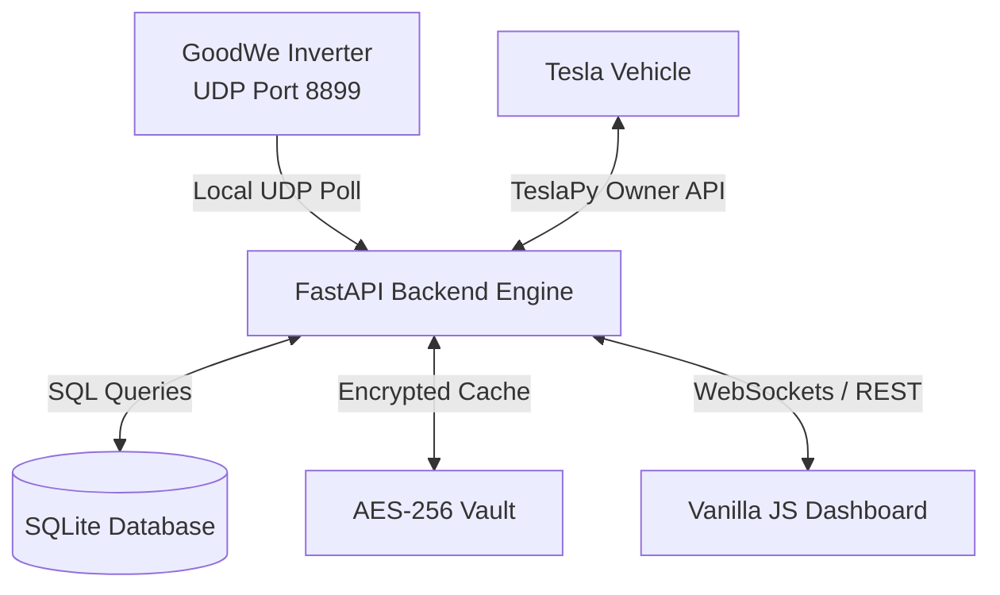

# Technical Architecture Specification: Smart Solar EV Charging

This document specifies the database schemas, cryptographic credential vaults, and REST/WebSocket API data contracts that drive the Smart Solar EV Charging backend.

---

## 1. System Topology & Data Flow

The application is engineered as a Python 3.10+ asynchronous service powered by **FastAPI**, with a local **SQLite** database and a WebSocket telemetry streaming system.



---

## 2. Database Schema DDL & Data Retention (SQLite)

We will use SQLite for persistent configuration parameters, caching local state, and telemetry logging.

### Path Resolution
*   **Database File:** `./src/backend/data/solar_sync.db` for local portability and ease of backup.

### Schema Definitions

```sql
-- 1. Configuration Settings Table
CREATE TABLE IF NOT EXISTS system_config (
    key TEXT PRIMARY KEY,
    value TEXT NOT NULL,
    updated_at TIMESTAMP DEFAULT CURRENT_TIMESTAMP
);

-- 2. Telemetry Log Table (Historical Analysis)
CREATE TABLE IF NOT EXISTS telemetry_logs (
    id INTEGER PRIMARY KEY AUTO_INCREMENT,
    timestamp TIMESTAMP DEFAULT CURRENT_TIMESTAMP,
    solar_generation_w INTEGER NOT NULL,
    house_consumption_w INTEGER NOT NULL,
    grid_active_power_w INTEGER NOT NULL,      -- Positive = Export, Negative = Import
    tesla_charge_rate_kw REAL NOT NULL,
    tesla_amps INTEGER NOT NULL,
    tesla_soc INTEGER NOT NULL,
    charge_state TEXT NOT NULL                  -- 'SMART_TRACKING', 'MANUAL_OVERRIDE', 'PAUSED'
);

-- 3. Daily Aggregates Table (Historical Analytics)
CREATE TABLE IF NOT EXISTS daily_aggregates (
    date DATE PRIMARY KEY,
    total_solar_diverted_kwh REAL NOT NULL,
    avg_capture_efficiency_pct REAL NOT NULL,
    peak_solar_power_w INTEGER NOT NULL
);

-- 4. Charge Sessions Table
CREATE TABLE IF NOT EXISTS charge_sessions (
    id INTEGER PRIMARY KEY AUTO_INCREMENT,
    start_time TIMESTAMP DEFAULT CURRENT_TIMESTAMP,
    end_time TIMESTAMP,
    total_energy_kwh REAL DEFAULT 0.0,
    average_solar_capture_pct REAL DEFAULT 0.0
);
```

### Telemetry Retention & Pruning Heuristic
*   **Retention Limit:** High-resolution telemetry data (`telemetry_logs`) is kept for exactly **7 days**.
*   **Daily Aggregation:** Before pruning, raw logs are compiled into daily metrics and saved to `daily_aggregates`.
*   **Pruning Execution:** On startup, the backend automatically deletes raw logs from `telemetry_logs` where `timestamp < datetime('now', '-7 days')` to prevent storage bloat.

---

## 3. Cryptographic Credential Container (AES-256-GCM)

To protect the raw Tesla access and refresh tokens at rest, the system uses an AES-256-GCM encrypted container for the TeslaPy `cache.json` file.

### Cryptographic Workflow
1.  **Key Derivation (PBKDF2):** On startup, the backend reads a 32+ character passphrase from the environment variable `VAULT_SECRET` and derives a 256-bit cryptographic key using PBKDF2 with HMAC-SHA256:
    *   **PBKDF2 Iteration Count:** **100,000 iterations** (OWASP-recommended benchmark for balanced speed and brute-force protection).
    *   **Salt:** A static salt is saved in the SQLite `system_config` table upon first-time setup.
2.  **Encryption (AES-256-GCM):** When TeslaPy refreshes or writes tokens, the raw JSON payload is encrypted using AES-256-GCM, producing a ciphertext, a 12-byte random initialization vector (IV), and a 16-byte authentication tag.
3.  **Storage:** The ciphertext, IV, and tag are written to a localized file `.cache.enc` with owner-only file permissions (`600`).
4.  **In-Memory Lifecycle:** The raw token data is never persisted in plaintext on-disk. It is decrypted in-memory during startup and loaded into TeslaPy's session memory.

---

## 4. API Contracts & WebSocket Streaming

FastAPI exposes REST API endpoints for state controls and configuration updates, alongside a high-velocity WebSocket stream for real-time dashboard rendering.

### 1. WebSocket Telemetry Stream (`WS /api/v1/live`)
*   **Throttling Cadence:** Streams updates at exactly **1 Hz (1 update per second)** when a client is active. This provides ultra-fluid SVG path and particle animations in the UI without causing layout thrashing or browser DOM rendering bottlenecks.
*   **Disconnect Recovery Heuristic:** If the WebSocket connection is interrupted, the front-end dashboard displays a glassmorphic blurred overlay with a "Connection Lost" warning and automatically attempts reconnection using an exponential backoff sequence (`1s`, `2s`, `4s`, `8s`, up to a maximum of `30s`).

```json
{
  "$schema": "http://json-schema.org/draft-07/schema#",
  "title": "TelemetryStreamPacket",
  "type": "OBJECT",
  "properties": {
    "timestamp": { "type": "STRING", "format": "date-time" },
    "connection_status": {
      "type": "OBJECT",
      "properties": {
        "inverter_online": { "type": "BOOLEAN" },
        "tesla_online": { "type": "BOOLEAN" }
      },
      "required": ["inverter_online", "tesla_online"]
    },
    "power_flow": {
      "type": "OBJECT",
      "properties": {
        "solar_generation_w": { "type": "INTEGER", "minimum": 0 },
        "house_consumption_w": { "type": "INTEGER", "minimum": 0 },
        "grid_active_power_w": { "type": "INTEGER" },
        "tesla_charging_w": { "type": "INTEGER", "minimum": 0 }
      },
      "required": ["solar_generation_w", "house_consumption_w", "grid_active_power_w", "tesla_charging_w"]
    },
    "tesla_status": {
      "type": "OBJECT",
      "properties": {
        "soc": { "type": "INTEGER", "minimum": 0, "maximum": 100 },
        "current_amps": { "type": "INTEGER", "minimum": 5, "maximum": 16 },
        "charge_limit_soc": { "type": "INTEGER", "minimum": 50, "maximum": 100 }
      },
      "required": ["soc", "current_amps", "charge_limit_soc"]
    },
    "control_mode": { "type": "STRING", "enum": ["SMART_TRACKING", "MANUAL_OVERRIDE", "PAUSED"] },
    "override_remaining_sec": { "type": "INTEGER" }
  },
  "required": ["timestamp", "connection_status", "power_flow", "tesla_status", "control_mode", "override_remaining_sec"]
}
```

### 2. Manual Override Post Request (`POST /api/v1/override`)
Triggers manual override on demand.

```json
{
  "title": "OverrideRequest",
  "type": "OBJECT",
  "properties": {
    "enabled": { "type": "BOOLEAN" },
    "target_amps": { "type": "INTEGER", "minimum": 5, "maximum": 16 },
    "duration_minutes": { "type": "INTEGER", "default": 120 }
  },
  "required": ["enabled", "target_amps"]
}
```

### 3. System Configuration Request (`POST /api/v1/config`)
Updates system static variables.

```json
{
  "title": "ConfigRequest",
  "type": "OBJECT",
  "properties": {
    "inverter_ip": { "type": "STRING", "format": "ipv4" },
    "voltage_v": { "type": "INTEGER", "enum": [230, 240, 110] },
    "phases": { "type": "INTEGER", "enum": [1, 3] },
    "tesla_email": { "type": "STRING", "format": "email" }
  },
  "required": ["inverter_ip", "voltage_v", "phases", "tesla_email"]
}
```
